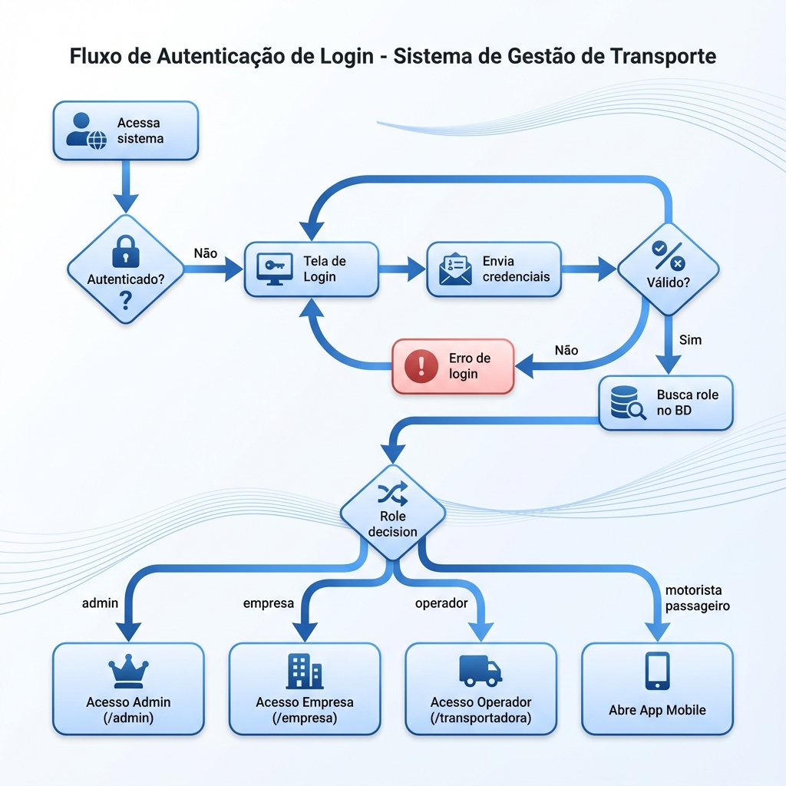
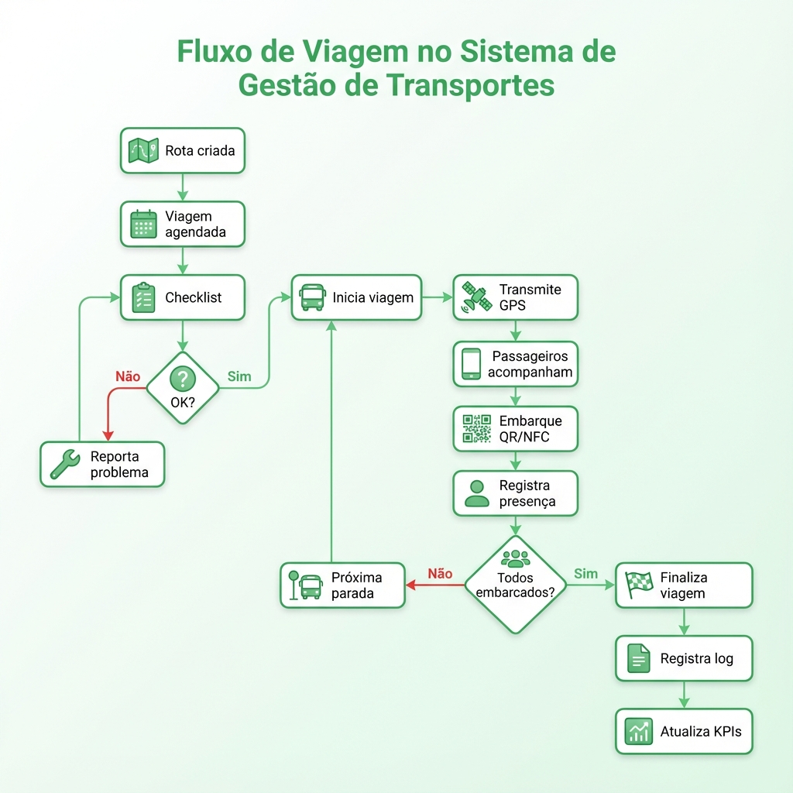

# 📋 PRD - Documento de Requisitos do Produto

## GolfFox - Sistema de Gestão de Transporte Urbano

**Versão:** 1.0  
**Data:** Outubro de 2025  
**Status:** Em Desenvolvimento  
**Autor:** Pedro Guilherme - SynVolt

---

## 1. Visão Geral do Produto

### 1.1 Propósito

O **GolfFox** é uma plataforma SaaS completa de gestão de transporte urbano corporativo, desenvolvida para atender empresas que necessitam de soluções integradas para o transporte de funcionários. O sistema oferece rastreamento GPS em tempo real, gestão completa de frotas, controle de custos, e uma experiência premium para todos os stakeholders.

### 1.2 Problema a Ser Resolvido

Empresas que oferecem transporte para funcionários enfrentam diversos desafios:

- **Falta de visibilidade** em tempo real da localização dos veículos
- **Dificuldade de comunicação** entre empresa, transportadora, motoristas e passageiros
- **Gestão ineficiente** de rotas e horários
- **Controle de custos** impreciso e manual
- **Ausência de métricas** para tomada de decisão
- **Experiência fragmentada** entre diferentes sistemas

### 1.3 Solução Proposta

Uma plataforma unificada com:

- **Rastreamento GPS em tempo real** de toda a frota
- **Painéis especializados** para cada tipo de usuário
- **Aplicativos móveis** para motoristas e passageiros
- **Dashboard analítico** com KPIs e relatórios automatizados
- **Gestão financeira** integrada com controle de custos
- **Notificações inteligentes** e alertas

### 1.4 Proposta de Valor

| Stakeholder | Benefício Principal |
|-------------|---------------------|
| **Empresa Contratante** | Visibilidade total do serviço e controle de custos |
| **Transportadora** | Gestão eficiente da frota e motoristas |
| **Motorista** | Ferramentas que facilitam o dia a dia |
| **Passageiro** | Informações em tempo real e experiência premium |
| **Administrador** | Controle total da plataforma multi-tenant |

---

## 2. Personas e Usuários

### 2.1 Administrador (Admin)

**Perfil:** Gestor da plataforma GolfFox  
**Objetivo:** Gerenciar todas as empresas, transportadoras e usuários da plataforma  
**Necessidades:**
- Visão global de todos os dados
- Gestão de permissões e acessos
- Relatórios consolidados
- Configuração do sistema

### 2.2 Gestor da Empresa (gestor_empresa)

**Perfil:** RH ou Gestor de Facilities de empresa que contrata o serviço de transporte  
**Objetivo:** Acompanhar o serviço contratado e gerenciar funcionários  
**Necessidades:**
- Cadastrar e gerenciar funcionários
- Acompanhar viagens em tempo real
- Visualizar custos e SLAs
- Receber alertas de atrasos

**Nota:** Anteriormente chamado de "Operador" ou "Empresa". O role foi consolidado em `gestor_empresa`.

### 2.3 Gestor da Transportadora (gestor_transportadora)

**Perfil:** Gestor ou Dispatcher da transportadora parceira  
**Objetivo:** Gerenciar frota, motoristas e operação diária  
**Necessidades:**
- Controle de veículos e manutenções
- Gestão de motoristas e documentos
- Acompanhamento de viagens
- Relatórios operacionais

**Nota:** Anteriormente chamado de "Operador" ou "Transportadora". O role foi consolidado em `gestor_transportadora`.

### 2.4 Motorista

**Perfil:** Condutor dos veículos de transporte  
**Objetivo:** Realizar as viagens de forma eficiente  
**Necessidades:**
- Checklist pré-viagem
- Navegação GPS integrada
- Comunicação com central
- Registro de embarques (QR/NFC)

### 2.5 Passageiro

**Perfil:** Funcionário que utiliza o transporte  
**Objetivo:** Chegar ao destino com conforto e pontualidade  
**Necessidades:**
- Ver localização do ônibus em tempo real
- Receber notificações de chegada
- Avaliar o serviço
- Solicitar alterações de rota

---

## 3. Funcionalidades do Sistema

### 3.1 Painel Administrativo (`/admin`)

#### 3.1.1 Dashboard
- **KPIs em tempo real:**
  - Total de viagens do dia
  - Veículos ativos
  - Funcionários em trânsito
  - Alertas críticos
  - Rotas do dia
- **Filtros avançados:** empresa, data, turno
- **Log de atividades recentes**

#### 3.1.2 Mapa da Frota
- Visualização em tempo real (Google Maps)
- Playback histórico com controles de velocidade
- Export PNG/CSV
- Filtros: empresa, rota, veículo, status, turno
- Deep-links para compartilhamento
- Legenda interativa

#### 3.1.3 Gestão de Rotas
- CRUD completo de rotas
- Geração automática de pontos de parada
- Otimização de rotas via algoritmos
- Visualização no mapa
- Associação com empresas e veículos

#### 3.1.4 Gestão de Veículos
- Cadastro completo (placa, modelo, capacidade, etc.)
- **Documentos anexados:**
  - CRLV
  - Licença ANTT
  - Foto do veículo
  - Certificado INMETRO
  - Certificado CADASTUR
  - ART
  - Laudo Técnico de Manutenção
- Histórico de manutenções
- Checklist de veículos

#### 3.1.5 Gestão de Motoristas
- Cadastro completo
- **Documentos anexados:**
  - CNH
  - Comprovante de Residência
  - Exames Toxicológicos
- Sistema de ranking e gamificação
- Avaliações de passageiros
- Controle de salários e benefícios

#### 3.1.6 Gestão de Empresas
- CRUD de empresas clientes
- Configurações de branding
- Associação de gestores da empresa (gestor_empresa)
- Listagem de funcionários
- Configurações de SLA

#### 3.1.7 Gestão de Transportadoras
- CRUD de transportadoras parceiras
- **Documentos anexados:**
  - Contrato de Prestação de Serviço
  - Cartão CNPJ
  - Contrato Social
  - Certificado ART
  - Certificado de Seguro
- Dados bancários (banco, agência, conta, PIX)
- Representante legal (nome, CPF, RG, CNH, email, telefone)
- Associação de veículos e motoristas
- Criação de logins de acesso

#### 3.1.8 Gestão de Permissões
- Controle de papéis (admin, gestor_empresa, gestor_transportadora, motorista, passageiro)
- Troca de roles de usuários
- Histórico de alterações
- Compatibilidade com roles antigos (empresa, operador, transportadora)

#### 3.1.9 Socorro e Emergências
- Despache de emergência
- Histórico de ocorrências
- Status de atendimento
- Comunicação com motoristas

#### 3.1.10 Sistema de Alertas
- Tipos: erro, aviso, informação
- Filtros e busca
- Histórico com paginação
- Notificações push

#### 3.1.11 Relatórios
- **Tipos de relatórios:**
  - Atrasos por período
  - Ocupação de veículos
  - Passageiros não embarcados
  - Eficiência de rotas
  - Ranking de motoristas
  - Performance geral
- **Formatos de exportação:** PDF, Excel, CSV
- Agendamento automático via cron
- Envio por email

#### 3.1.12 Gestão de Custos e Financeiro
- **Custos Manuais:**
  - Cadastro de custos por categoria
  - Custos recorrentes (diário, semanal, mensal, anual)
  - Vínculo com veículos, rotas e motoristas
  - Anexos e notas
  - Status: pendente, confirmado, cancelado
  - Aprovação de custos
- **Receitas Manuais:**
  - Cadastro de receitas
  - Vínculo com contratos e faturas
  - Receitas recorrentes
  - Anexos e notas
- **Orçamentos:**
  - Orçamento por categoria e período (mês/ano)
  - Alertas quando atinge threshold (padrão 80%)
  - Comparativo custo vs orçamento
  - Variação percentual
- **Projeções Financeiras:**
  - Projeções de custos e receitas
  - Métodos: média móvel, regressão linear, sazonal
  - Nível de confiança
  - Comparativo projeção vs realizado
- **Alertas Financeiros:**
  - Orçamento excedido
  - Despesa incomum
  - Custo recorrente vencendo
  - Desvio de projeção
- **Categorias de Custos:**
  - Categorias por perfil (admin, empresa, transportadora, all)
  - Hierarquia de categorias (parent_id)
  - Ícones e cores personalizados
  - Palavras-chave para sugestões inteligentes
  - Categorias operacionais vs administrativas
- **Conciliação:**
  - Conciliação de faturas
  - Workflow de aprovação
  - Export de relatórios de conciliação
- **Import/Export:**
  - Import de custos via CSV/Excel
  - Export de relatórios (PDF, Excel, CSV)
  - Export de dados para análise

#### 3.1.13 Central de Ajuda
- FAQ dinâmico
- Suporte via WhatsApp
- Documentação técnica
- Status do sistema

#### 3.1.14 Sincronização
- Monitor de operações Supabase
- Reprocessamento de falhas
- Status em tempo real

#### 3.1.15 Analytics e Projeções
- Dashboard analítico avançado
- Métricas de Web Vitals (Core Web Vitals)
- Análise de performance
- Projeções financeiras
- Tendências e padrões

#### 3.1.16 Monitoramento
- Monitoramento de sistema
- Métricas de performance
- Alertas operacionais
- Status de serviços

#### 3.1.17 Escalonamento
- Gestão de escalas
- Planejamento de recursos
- Alocação de veículos e motoristas

#### 3.1.18 Configurações
- Configurações gerais do sistema
- Preferências de usuário
- Configurações de notificações

#### 3.1.19 Contratos
- Gestão de contratos
- Documentos contratuais
- Renovações e vencimentos

#### 3.1.20 Migração
- Ferramentas de migração de dados
- Validação de integridade
- Correção de inconsistências

#### 3.1.21 Preferências
- Configurações de usuário
- Preferências de interface
- Notificações

### 3.2 Painel do Gestor da Empresa (`/empresa`)

**Acesso:** Usuários com role `gestor_empresa` ou `admin`  
**Nota:** Este painel era anteriormente chamado "Painel do Operador" e acessado via `/operador`. Foi renomeado para refletir melhor sua função.

#### 3.2.1 Dashboard
- Total de viagens
- Viagens em andamento/concluídas
- Atrasos acima de 5 minutos
- Ocupação média
- Custo diário
- SLA D0
- Lista de viagens com filtros

#### 3.2.2 Gestão de Funcionários
- Lista com busca e filtros
- Cadastro com geocodificação automática
- Status de transporte

#### 3.2.3 Visualização de Rotas
- Rotas atribuídas
- Status das rotas
- Mapa interativo

#### 3.2.4 Alertas
- Filtros por tipo
- Notificações específicas da empresa

#### 3.2.5 Comunicações
- Mensagens para funcionários
- Avisos gerais

#### 3.2.6 Conformidade
- Documentos regulatórios
- Certificações

#### 3.2.7 Custos
- Visão de custos da empresa
- Comparativo mensal

#### 3.2.8 Relatórios
- Relatórios específicos
- Export de dados

#### 3.2.9 Solicitações
- Pedidos de funcionários
- Workflow de aprovação

#### 3.2.10 Gestão de Prestadores
- Transportadoras associadas

#### 3.2.11 Centros de Custo
- Gestão de centros de custo
- Alocação de custos

#### 3.2.12 Satisfação
- Avaliações de passageiros
- NPS e feedback
- Métricas de satisfação

#### 3.2.13 Sincronizar
- Sincronização de dados
- Status de sincronização

### 3.3 Painel do Gestor da Transportadora (`/transportadora`)

**Acesso:** Usuários com role `gestor_transportadora` ou `admin`  
**Nota:** Os roles `operador` e `transportadora` foram consolidados em `gestor_transportadora`.

#### 3.3.1 Dashboard
- Total da frota
- Veículos em rota
- Motoristas ativos
- Veículos atrasados
- Visualização do mapa
- Lista de motoristas ativos
- Status da frota

#### 3.3.2 Mapa da Frota
- Todos os veículos em tempo real
- Integração com rotas
- Zoom e navegação

#### 3.3.3 Gestão de Veículos
- Lista detalhada da frota
- Informações completas
- Upload de documentos
- Registro de manutenções

#### 3.3.4 Gestão de Motoristas
- Lista de motoristas
- Documentação
- Exames
- Contato
- Ranking

#### 3.3.5 Alertas
- Notificações da transportadora
- Filtros e busca

#### 3.3.6 Relatórios
- Frota em uso
- Performance de motoristas
- Viagens realizadas
- Export (CSV/Excel/PDF)

#### 3.3.7 Custos
- Custos por rota
- Custos por veículo
- Relatórios financeiros
- Categorias de custos
- Orçamentos

#### 3.3.8 Receitas
- Gestão de receitas
- Faturamento
- Contratos

#### 3.3.9 Margens
- Análise de margens
- Rentabilidade
- Indicadores financeiros

#### 3.3.10 Mensagens
- Chat com motoristas
- Comunicação central
- Mensagens de emergência

#### 3.3.11 Motoristas - Ranking
- Sistema de ranking
- Gamificação
- Conquistas e badges

#### 3.3.12 Motoristas - SLA
- Indicadores de SLA
- Performance de motoristas
- Metas e objetivos

#### 3.3.13 Veículos - Manutenção
- Histórico de manutenções
- Manutenção preventiva
- Manutenção corretiva
- Alertas de manutenção

### 3.4 Aplicativo Móvel - Motorista

#### 3.4.1 Login e Autenticação
- Login com email/senha
- Sessão persistente

#### 3.4.2 Dashboard
- Viagens do dia
- Status atual

#### 3.4.3 Checklist Pré-Rota
- Verificação de itens obrigatórios
- Registro fotográfico
- Confirmação de partida

#### 3.4.4 Navegação GPS
- Mapa com rastreamento
- Rotas otimizadas
- Pontos de parada

#### 3.4.5 Scanner QR/NFC
- Validação de embarque
- Registro de passageiros

#### 3.4.6 Histórico
- Viagens realizadas
- Estatísticas pessoais
- Performance individual

#### 3.4.7 Comunicação
- Chat com central
- Botão de emergência
- Mensagens de sistema
- Notificações push

#### 3.4.8 Perfil
- Dados pessoais
- Documentos
- Configurações
- Preferências

### 3.5 Aplicativo Móvel - Passageiro

#### 3.5.1 Login e Autenticação
- Login com email/senha
- Código de empresa

#### 3.5.2 Dashboard
- Próxima viagem
- Informações do veículo/motorista

#### 3.5.3 Mapa em Tempo Real
- Localização do ônibus
- ETA (tempo estimado de chegada)
- Pontos de parada

#### 3.5.4 Detalhes de Rota
- Horários
- Paradas
- Estimativas

#### 3.5.5 Notificações
- Ônibus chegando
- Atrasos
- Alterações de rota

#### 3.5.6 Avaliação
- Avaliar viagem (NPS 0-10)
- Tags de avaliação
- Feedback sobre motorista
- Comentários

#### 3.5.7 Cancelamentos
- Registrar não-embarque
- Motivos: home office, folga, férias, médico, outro
- Pausar notificações temporariamente
- Histórico de cancelamentos

#### 3.5.8 Anúncios
- Mural de avisos
- Notificações da empresa
- Avisos urgentes
- Avisos por tipo (info, alerta, urgente)

#### 3.5.9 Perfil
- Dados pessoais
- Endereço e localização
- Preferências de notificação
- Configurações

---

## 4. Requisitos Não-Funcionais

### 4.1 Performance

| Métrica | Alvo |
|---------|------|
| Tempo de carregamento inicial | < 3 segundos |
| Atualização de mapa em tempo real | < 1 segundo |
| Resposta de API | < 500ms (p95) |
| Disponibilidade | 99.9% uptime |

### 4.2 Segurança

- **Autenticação:** JWT com cookies HttpOnly
- **Autorização:** RBAC (Role-Based Access Control)
- **Isolamento:** RLS (Row Level Security) no Supabase
- **Proteção:** CSRF tokens, rate limiting (Upstash Redis)
- **Dados:** Criptografia em trânsito (TLS) e em repouso
- **Auditoria:** Log de todas as operações sensíveis

### 4.3 Escalabilidade

- Arquitetura serverless com Vercel Edge Functions
- Banco de dados PostgreSQL gerenciado (Supabase)
- CDN para assets estáticos
- Cache em múltiplas camadas (TanStack Query + HTTP)

### 4.4 Usabilidade

- Design responsivo (mobile-first)
- Acessibilidade WCAG 2.1 AA
- Suporte a múltiplos idiomas (Português BR)
- Tema claro com opção de tema escuro

### 4.5 Manutenibilidade

- Código TypeScript tipado
- Clean Architecture + DDD
- Testes unitários e E2E
- Documentação inline e técnica

---

## 5. Arquitetura Técnica

### 5.1 Stack Tecnológica

#### Frontend Web
| Tecnologia | Versão | Propósito |
|------------|--------|-----------|
| Next.js | 16.1.0 | Framework React |
| React | 19.1.0 | UI Library |
| TypeScript | 5.9.3 | Tipagem |
| Tailwind CSS | 4.1.17 | Estilização |
| Radix UI | Latest | Componentes acessíveis |
| Zustand | 5.0.2 | Estado global |
| TanStack Query | 5.90.12 | Data fetching |

#### Frontend Mobile
| Tecnologia | Versão | Propósito |
|------------|--------|-----------|
| React Native | 0.81.5 | Framework mobile |
| Expo | ~54.0.29 | Build tool e runtime |
| Expo Router | ~6.0.19 | Navegação |
| React Native Paper | 5.14.5 | Componentes UI |
| react-native-maps | 1.20.1 | Mapas |

#### Backend
| Tecnologia | Propósito |
|------------|-----------|
| Supabase | BaaS (Auth, Storage, Realtime) |
| PostgreSQL | Banco de dados |
| Upstash Redis | Rate limiting |
| Vercel | Hosting + Edge Functions |

### 5.2 Estrutura de Dados

#### Tabelas Principais

##### Autenticação e Usuários
- `users` - Usuários do sistema (admin, gestor_empresa, gestor_transportadora, motorista, passageiro)
- `gf_user_company_map` - Mapeamento multi-tenant usuários-empresas

##### Empresas e Transportadoras
- `companies` - Empresas contratantes
- `carriers` - Transportadoras
- `gf_employee_company` - Funcionários das empresas
- `gf_carrier_driver_map` - Mapeamento motoristas-transportadoras
- `gf_carrier_vehicle_map` - Mapeamento veículos-transportadoras

##### Frota e Operação
- `vehicles` - Veículos da frota
- `drivers` - Motoristas (view de users com role='motorista')
- `routes` - Rotas de transporte
- `trips` - Viagens realizadas
- `trip_passengers` - Passageiros por viagem
- `gf_route_plan` - Plano de rota com pontos ordenados

##### Rastreamento GPS
- `motorista_locations` - Histórico de localização GPS dos motoristas
- `motorista_positions` - View/compatibilidade para posições GPS

##### Documentos
- `vehicle_documents` - Documentos de veículos (CRLV, ANTT, etc.)
- `driver_documents` - Documentos de motoristas (CNH, exames, etc.)

##### Sistema Financeiro
- `gf_manual_costs_v2` - Custos manuais (expandido com recorrência)
- `gf_cost_categories` - Categorias de custos por perfil
- `gf_manual_revenues` - Receitas manuais
- `gf_budgets` - Orçamentos por categoria e período
- `gf_financial_forecasts` - Projeções financeiras
- `gf_financial_alerts` - Alertas financeiros (orçamento excedido, etc.)

##### Mobile e Check-ins
- `passageiro_checkins` - Check-ins de embarque/desembarque (QR/NFC/manual)
- `veiculo_checklists` - Checklists pré-viagem do motorista
- `passageiro_cancellations` - Registro de não-embarques
- `trip_evaluations` - Avaliações NPS das viagens
- `announcements` - Mural de avisos para passageiros e motoristas

##### Comunicação
- `motorista_messages` - Mensagens entre motorista e central

##### Notificações e Alertas
- `gf_notifications` - Notificações do sistema
- `gf_alerts` - Alertas operacionais
- `gf_operational_alerts` - Alertas operacionais (performance, segurança, erros)

##### Socorro e Emergências
- `gf_assistance_requests` - Solicitações de socorro/emergência
- `gf_service_requests` - Solicitações de serviço
- `gf_incidents` - Incidentes registrados

##### Relatórios
- `gf_report_schedules` - Agendamentos de relatórios
- `gf_report_history` - Histórico de gerações de relatórios

##### Auditoria e Eventos
- `gf_audit_log` - Log de auditoria de todas as ações
- `gf_event_store` - Event store para event sourcing (todos os eventos de domínio)

##### Manutenção
- `gf_vehicle_maintenance` - Manutenção preventiva de veículos
- `gf_veiculo_checklists` - Checklists de verificação pré-viagem

##### Analytics e Métricas
- `gf_web_vitals` - Métricas de Core Web Vitals coletadas do frontend

##### Gamificação
- `gf_driver_rankings` - Rankings de motoristas
- `gf_achievements` - Conquistas e badges

##### Custos (Legado - em migração)
- `gf_costs` - Custos operacionais (legado)
- `gf_cost_budgets` - Orçamentos (legado)

**Nota:** O sistema mantém compatibilidade com roles antigos (`empresa`, `operador`, `transportadora`) nas tabelas existentes.

#### Views e Materialized Views

##### Views de KPIs
- `v_admin_dashboard_kpis` - KPIs para painel admin
- `v_admin_dashboard_kpis_secure` - KPIs admin com RLS
- `v_operador_dashboard_kpis_secure` - KPIs do gestor da empresa com RLS
- `v_admin_financial_kpis` - KPIs financeiros consolidados

##### Views Multi-tenant
- `v_my_companies` - Empresas do gestor (com RLS)
- `v_operador_routes_secure` - Rotas do gestor da empresa
- `v_operador_alerts_secure` - Alertas do gestor da empresa
- `v_operador_costs_secure` - Custos do gestor da empresa

##### Views de Rastreamento
- `v_driver_last_position` - Última posição de cada motorista
- `v_active_trips` - Viagens ativas consolidadas
- `v_trip_positions` - Posições por viagem
- `v_live_vehicles` - Veículos em tempo real
- `v_route_polylines` - Polilinhas das rotas
- `v_trip_status` - Status das viagens

##### Views de Relatórios
- `v_reports_delays` - Relatório de atrasos
- `v_reports_delays_secure` - Relatório de atrasos com RLS
- `v_reports_occupancy` - Relatório de ocupação
- `v_reports_occupancy_secure` - Relatório de ocupação com RLS
- `v_reports_not_boarded` - Passageiros não embarcados
- `v_reports_not_boarded_secure` - Passageiros não embarcados com RLS
- `v_reports_efficiency` - Eficiência de rotas
- `v_reports_efficiency_secure` - Eficiência de rotas com RLS
- `v_reports_roi_sla_secure` - ROI e SLA

##### Views de Custos
- `v_costs_breakdown` - Breakdown de custos
- `v_costs_vs_budget_monthly` - Custos vs Orçamento mensal
- `v_vehicle_costs_summary` - Resumo de custos por veículo

##### Views de Alertas
- `v_alerts_open` - Alertas abertos

##### Materialized Views
- `mv_admin_kpis` - Materialized view de KPIs admin (atualizada via cron)
- `mv_operador_kpis` - Materialized view de KPIs do gestor da empresa

#### Funções RPC (Remote Procedure Calls)

##### Funções de Helper
- `is_admin()` - Verifica se usuário é admin
- `company_ownership()` - Verifica ownership de empresa
- `get_user_role()` - Obtém role do usuário atual
- `get_user_company_id()` - Obtém company_id do usuário
- `get_user_carrier_id()` - Obtém carrier_id do usuário

##### Funções de Mapa
- `gf_map_snapshot_full(p_company_id, p_route_id)` - Retorna snapshot completo do mapa (veículos, paradas, garagens, rotas)
- `v_positions_by_interval()` - Posições por intervalo de tempo

##### Funções de Rotas
- `rpc_optimize_route()` - Otimiza rota usando algoritmos
- `rpc_generate_stops()` - Gera pontos de parada automaticamente
- `rpc_request_route_change()` - Solicita alteração de rota

##### Funções de Viagens
- `rpc_trip_transition()` - Transição de status de viagem
- `calculate_trip_summary()` - Calcula resumo da viagem (distância, tempo, etc.)
- `rpc_reopen_trip()` - Reabre viagem encerrada

##### Funções de Custos
- `rpc_calculate_route_cost()` - Calcula custo de rota
- `rpc_reconcile_costs()` - Concilia custos
- `rpc_export_costs()` - Exporta custos
- `generate_recurring_costs()` - Gera custos recorrentes automaticamente
- `check_budget_alerts()` - Verifica e cria alertas de orçamento excedido

##### Funções de Relatórios
- `rpc_generate_report()` - Gera relatório
- `rpc_schedule_report()` - Agenda relatório
- `rpc_dispatch_report()` - Despacha relatório por email

##### Funções de Refresh
- `refresh_mv_admin_kpis()` - Atualiza materialized view de KPIs admin
- `refresh_mv_admin_kpis_with_cleanup()` - Atualiza com limpeza
- `refresh_mv_operador_kpis()` - Atualiza materialized view de KPIs do gestor

##### Funções de Triggers
- `update_updated_at_column()` - Atualiza campo updated_at
- `update_updated_at()` - Atualiza campo updated_at (alternativa)
- `update_gf_report_schedules_updated_at()` - Atualiza updated_at de agendamentos

### 5.3 Integrações Externas

| Serviço | Propósito |
|---------|-----------|
| Google Maps API | Mapas e geocodificação |
| Supabase Auth | Autenticação |
| Supabase Storage | Armazenamento de arquivos |
| Supabase Realtime | WebSockets para tempo real |
| Vercel Analytics | Métricas de performance |
| SendGrid / Resend | Envio de emails |

### 5.4 APIs e Endpoints

#### APIs Admin (`/api/admin/*`)
- **Empresas:** CRUD completo, documentos, funcionários, criação de logins
- **Transportadoras:** CRUD completo, documentos, dados bancários, representante legal, veículos, motoristas, criação de logins
- **Rotas:** CRUD, geração automática de pontos, otimização
- **Veículos:** CRUD, documentos, manutenção
- **Motoristas:** CRUD, documentos, compensação, exames
- **Usuários:** CRUD, mudança de role, permissões
- **Alertas:** CRUD, listagem
- **Socorro:** Listagem, despache de emergência, veículos/motoristas disponíveis
- **Custos:** Listagem, opções
- **KPIs:** Dashboard KPIs
- **Auditoria:** Logs de auditoria, verificação de banco

#### APIs de Custos (`/api/costs/*`)
- **Manual:** CRUD de custos manuais
- **Manual-v2:** CRUD de custos manuais expandidos
- **Categorias:** Gestão de categorias
- **Orçamentos:** CRUD de orçamentos
- **Conciliação:** Processo de conciliação
- **KPIs:** KPIs financeiros
- **Export/Import:** Exportação e importação de dados
- **vs-budget:** Comparativo custo vs orçamento

#### APIs de Relatórios (`/api/reports/*`)
- **Run:** Execução de relatórios
- **Schedule:** Agendamento de relatórios
- **Dispatch:** Despache de relatórios por email

#### APIs da Empresa (`/api/empresa/*`)
- **Funcionários:** CRUD de funcionários
- **Anúncios:** Gestão de anúncios
- **Cancelamentos:** Gestão de cancelamentos
- **Avaliações:** Gestão de avaliações
- **Histórico de Rotas:** Histórico de rotas
- **Otimização de Rota:** Otimização de rotas
- **Associação:** Associação com empresa

#### APIs da Transportadora (`/api/transportadora/*`)
- **Motoristas:** CRUD, documentos, exames
- **Veículos:** CRUD, manutenção
- **Check-ins:** Listagem de check-ins
- **Checklists:** Gestão de checklists
- **Localizações:** Rastreamento GPS
- **Mensagens:** Chat motorista-central
- **Avaliações:** Avaliações de motoristas
- **Alertas:** Alertas da transportadora
- **Custos:** Custos por rota/veículo
- **Relatórios:** Performance, frota, viagens
- **Storage:** URLs assinadas para upload

#### APIs de Autenticação (`/api/auth/*`)
- **Login:** Autenticação de usuários
- **Me:** Dados do usuário atual
- **CSRF:** Geração de tokens CSRF
- **Reset Password:** Recuperação de senha
- **Set/Clear Session:** Gerenciamento de sessão
- **Seed Admin:** Criação de usuário admin (dev)

#### APIs de Notificações (`/api/notifications/*`)
- **Check Proximity:** Verificação de proximidade
- **Email:** Envio de emails

#### APIs de Analytics (`/api/analytics/*`)
- **Web Vitals:** Coleta de métricas de Core Web Vitals

#### APIs de Receitas (`/api/revenues`)
- CRUD de receitas manuais
- Filtros e paginação
- Exportação

#### APIs de Orçamentos (`/api/budgets`)
- CRUD de orçamentos
- Alertas de threshold

#### APIs Utilitárias
- **CEP:** Consulta de CEP (via API externa)
- **Upload:** Upload de arquivos
- **Health:** Health check do sistema
- **Test Session:** Diagnóstico de sessão (dev)

#### Cron Jobs (`/api/cron/*`)
- **Refresh KPIs:** Atualização de materialized views de KPIs
- **Refresh Costs MV:** Atualização de materialized views de custos
- **Dispatch Reports:** Despache automático de relatórios agendados

### 5.5 Event Sourcing e Auditoria

#### Event Store
O sistema utiliza **Event Sourcing** para rastreabilidade completa de todas as ações:

- **Tabela `gf_event_store`:**
  - Armazena todos os eventos de domínio
  - Eventos imutáveis com timestamp
  - Metadados completos (usuário, IP, user agent, etc.)
  - Suporte a replay de eventos
  - Agregação por tipo de evento e aggregate

- **Tipos de Eventos:**
  - Criação/atualização/exclusão de entidades
  - Transições de status
  - Ações de usuários
  - Eventos de sistema

#### Auditoria
- **Tabela `gf_audit_log`:**
  - Log completo de todas as ações
  - Rastreamento de mudanças
  - Histórico de alterações
  - Informações de contexto (IP, user agent, rota)
  - Tempo de execução de operações

### 5.6 Sistema de Alertas Operacionais

#### Alertas do Sistema
- **Tipos de Alertas:**
  - Performance (tempo de resposta, latência)
  - Segurança (tentativas de acesso, violações)
  - Erros (exceções, falhas)
  - Métricas (KPIs fora do normal)
  - Sistema (disponibilidade, recursos)

- **Severidades:**
  - Info: Informativo
  - Warning: Aviso
  - Error: Erro
  - Critical: Crítico

- **Funcionalidades:**
  - Filtros por tipo e severidade
  - Resolução de alertas
  - Histórico completo
  - Notificações push

### 5.7 Web Vitals e Performance

#### Core Web Vitals
- **Coleta de Métricas:**
  - LCP (Largest Contentful Paint)
  - FID (First Input Delay)
  - CLS (Cumulative Layout Shift)
  - FCP (First Contentful Paint)
  - TTFB (Time to First Byte)

- **Armazenamento:**
  - Tabela `gf_web_vitals`
  - Métricas por URL
  - Timestamp e user agent
  - Análise de tendências

### 5.8 Sistema de Check-ins e Checklists

#### Check-ins de Passageiros
- **Tipos de Check-in:**
  - Embarque (boarding)
  - Desembarque (dropoff)

- **Métodos de Validação:**
  - QR Code
  - NFC
  - Manual (pelo motorista)

- **Dados Capturados:**
  - Localização GPS
  - Nome da parada
  - Identificador do passageiro
  - Timestamp

#### Checklists Pré-viagem
- **Itens do Checklist:**
  - Verificação de itens obrigatórios
  - Status de cada item (checked/unchecked)
  - Notas por item
  - Fotos de evidência

- **Funcionalidades:**
  - Checklist por viagem
  - Registro fotográfico
  - Leitura de odômetro
  - Status: pendente, aprovado, rejeitado, incompleto
  - Revisão por supervisor

---

## 6. Fluxos de Usuário

### 6.1 Fluxo de Login

**Descrição do fluxo:**
1. Usuário acessa o sistema
2. Verifica se está autenticado
3. Se não: exibe tela de login → envia credenciais
4. Valida credenciais no Supabase Auth
5. Busca role do usuário no banco de dados (tabela `users`)
6. Redireciona automaticamente baseado no role:
   - `admin` → `/admin`
   - `gestor_empresa` → `/empresa` (compatibilidade: `empresa` também redireciona)
   - `gestor_transportadora` → `/transportadora` (compatibilidade: `operador` e `transportadora` também redirecionam)
   - `motorista` / `passageiro` → Abre app mobile

### 6.2 Fluxo de Viagem

**Descrição do fluxo:**
1. **Criação da rota** → Viagem é agendada no sistema
2. **Checklist pré-viagem** → Motorista verifica itens obrigatórios
3. **Início da viagem** → GPS começa a transmitir posição em tempo real
4. **Embarque** → Passageiros acompanham pelo app e embarcam via QR/NFC
5. **Registro de presença** → Sistema registra cada embarque
6. **Loop de paradas** → Repete até todos os passageiros embarcarem
7. **Finalização** → Viagem encerrada, log registrado, KPIs atualizados

---

## 7. Roadmap

### Fase 1 - MVP (✅ Concluído)
- [x] Painel Admin completo
- [x] Painel Empresa básico
- [x] Painel Transportadora básico
- [x] Sistema de autenticação
- [x] Mapa em tempo real
- [x] Gestão de rotas
- [x] Gestão de veículos
- [x] Gestão de motoristas

### Fase 2 - Expansão (🔄 Em Andamento)
- [x] Sistema de documentos anexados
- [x] Dados bancários de transportadoras
- [x] Representante legal
- [ ] App móvel do motorista
- [ ] App móvel do passageiro
- [ ] Sistema de checklist
- [ ] Validação QR/NFC

### Fase 3 - Analytics
- [ ] Dashboard analítico avançado
- [ ] Machine Learning para otimização de rotas
- [ ] Previsão de demanda
- [ ] Relatórios customizáveis

### Fase 4 - Enterprise
- [ ] SSO/SAML
- [ ] API pública
- [ ] White-label
- [ ] Integrações com ERP

---

## 8. Métricas de Sucesso

| KPI | Meta | Medição |
|-----|------|---------|
| Uptime | 99.9% | Mensal |
| Tempo médio de resposta | < 500ms | Diário |
| NPS dos usuários | > 70 | Trimestral |
| Taxa de adoção | > 80% | Mensal |
| Redução de custos operacionais | 20% | Anual |
| Satisfação do passageiro | > 4.5/5 | Mensal |

---

## 9. Riscos e Mitigações

| Risco | Probabilidade | Impacto | Mitigação |
|-------|---------------|---------|-----------|
| Falha no GPS | Média | Alto | Fallback com última posição conhecida |
| Indisponibilidade Supabase | Baixa | Crítico | Cache local + fallback mode |
| Vazamento de dados | Baixa | Crítico | RLS + criptografia + auditoria |
| Baixa adoção | Média | Alto | Treinamento + UX simplificado |
| Problemas de conectividade | Alta | Médio | Modo offline nos apps mobile |

---

## 10. Glossário

| Termo | Definição |
|-------|-----------|
| **transportadora** | Transportadora parceira responsável pelos veículos |
| **Empresa** | Empresa que contrata o serviço de transporte |
| **gestor_empresa** | Usuário que gerencia a empresa contratante (anteriormente "operador" ou "empresa") |
| **gestor_transportadora** | Usuário que gerencia a transportadora (anteriormente "operador" ou "transportadora") |
| **RLS** | Row Level Security - segurança a nível de linha no banco |
| **Multi-tenant** | Arquitetura que suporta múltiplos clientes isolados |
| **KPI** | Key Performance Indicator - indicador de desempenho |
| **SLA** | Service Level Agreement - acordo de nível de serviço |

---

## 11. Anexos

### 11.1 Documentação Relacionada
- [ARCHITECTURE.md](./ARCHITECTURE.md) - Arquitetura técnica detalhada
- [PAINEIS.md](./PAINEIS.md) - Especificação dos painéis web
- [TRANSPORTADORAS_PANEL.md](./TRANSPORTADORAS_PANEL.md) - Documentação do painel de transportadoras
- [CONTRIBUTING.md](./CONTRIBUTING.md) - Guia de contribuição
- [TROUBLESHOOTING.md](./TROUBLESHOOTING.md) - Guia de solução de problemas

### 11.2 URLs do Sistema
- **Login:** https://golffox.vercel.app
- **Admin:** https://golffox.vercel.app/admin
- **Gestor da Empresa:** https://golffox.vercel.app/empresa
- **Gestor da Transportadora:** https://golffox.vercel.app/transportadora

**Nota:** A rota `/operador` foi descontinuada e redireciona para `/transportadora` para compatibilidade.

### 11.3 Credenciais de Teste
- **Admin:** golffox@admin.com / senha123
- **Gestor da Empresa:** teste@empresa.com / senha123
- **Gestor da Transportadora:** teste@transportadora.com / senha123
- **Motorista:** teste@motorista.com / senha123
- **Passageiro:** teste@passageiro.com / senha123

### 11.4 Roles e Permissões

| Role | Descrição | Painel Acessível | Notas |
|------|-----------|------------------|-------|
| `admin` | Administrador do sistema | `/admin` | Acesso total |
| `gestor_empresa` | Gestor da empresa contratante | `/empresa` | Anteriormente `empresa` ou `operador` |
| `gestor_transportadora` | Gestor da transportadora | `/transportadora` | Anteriormente `operador` ou `transportadora` |
| `motorista` | Motorista | App Mobile | Sem acesso aos painéis web |
| `passageiro` | Passageiro/Funcionário | App Mobile | Sem acesso aos painéis web |

**Compatibilidade:** O sistema mantém suporte aos roles antigos (`empresa`, `operador`, `transportadora`) para compatibilidade com dados existentes, mas novos usuários devem usar os roles atualizados.

---
**Documento atualizado em:** Janeiro de 2025  
**Próxima revisão:** Fevereiro de 2025
