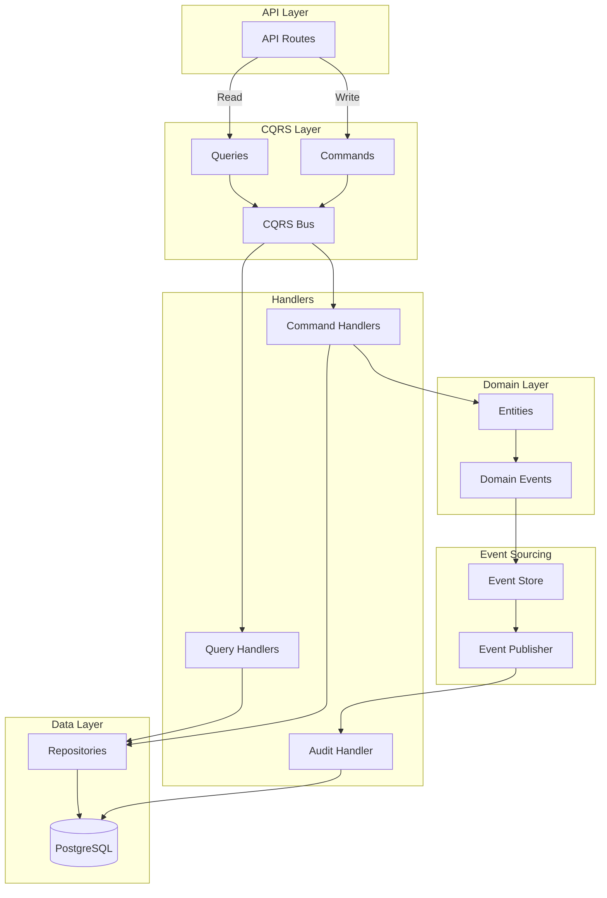
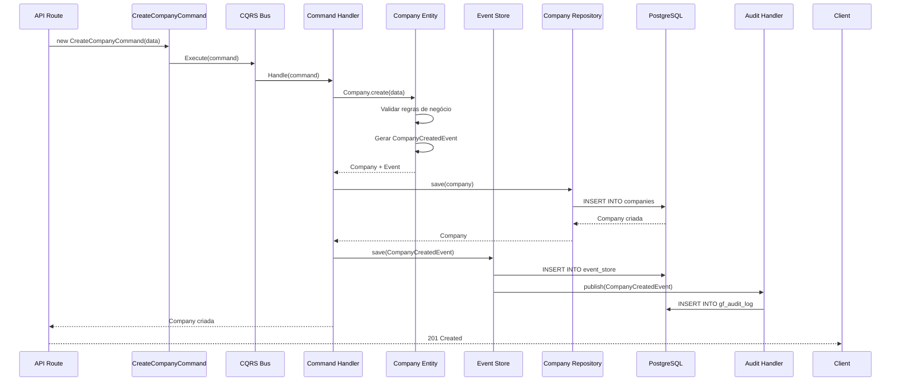
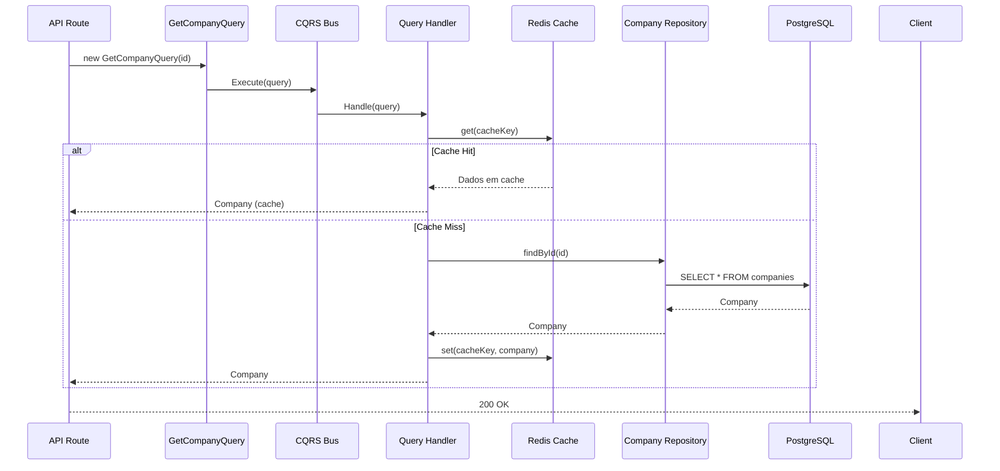
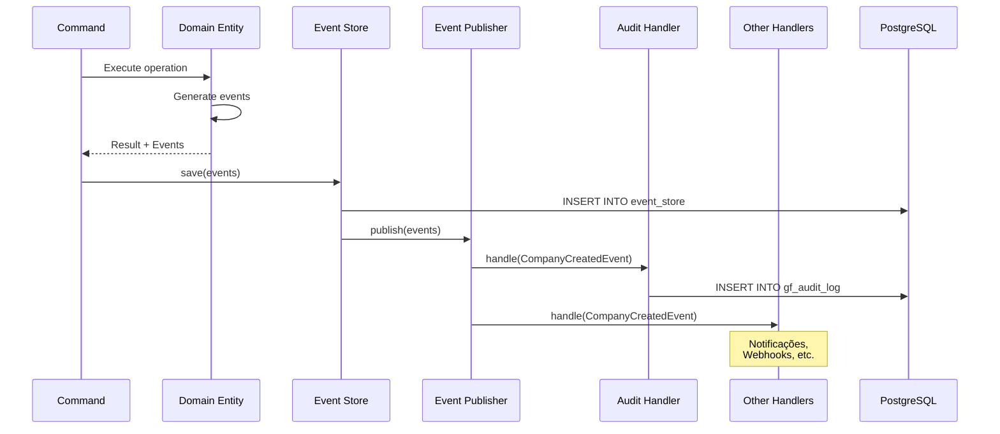
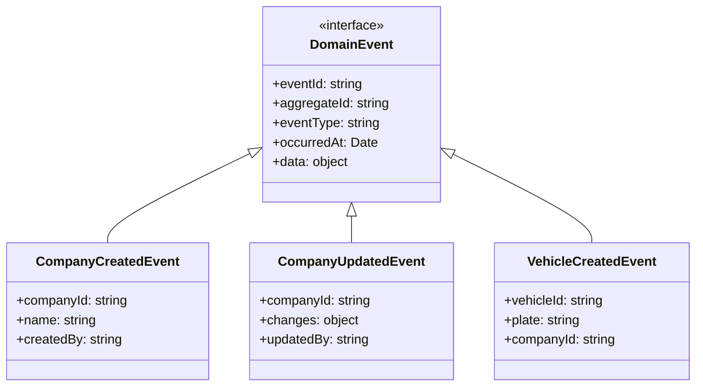
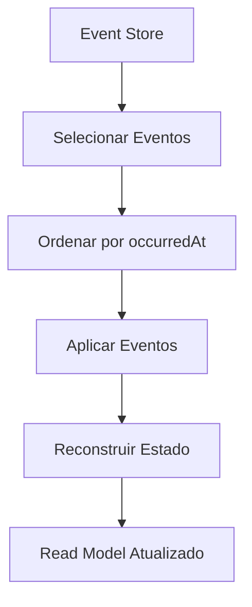

# Diagrama de Fluxo CQRS - GolfFox

**Última atualização:** 2025-01-XX

---

## 📊 Visão Geral

Este documento descreve o fluxo CQRS (Command Query Responsibility Segregation) e Event Sourcing para auditoria no GolfFox.

---

## 🏗️ Arquitetura CQRS



---

## 📝 Fluxo de Command (Escrita)



---

## 🔍 Fluxo de Query (Leitura)



---

## 📨 Fluxo de Event Sourcing



---

## 🗂️ Estrutura de Eventos



---

## 🔄 Replay de Eventos (Futuro)



---

## 📋 Exemplo: Criar Empresa

### 1. Command

```typescript
class CreateCompanyCommand {
  name: string
  email?: string
  phone?: string
}
```

### 2. Handler

```typescript
class CreateCompanyHandler {
  async handle(command: CreateCompanyCommand): Promise<Company> {
    // 1. Validar
    // 2. Criar entidade
    // 3. Salvar
    // 4. Publicar evento
  }
}
```

### 3. Event

```typescript
class CompanyCreatedEvent {
  companyId: string
  name: string
  createdAt: Date
}
```

### 4. Audit Handler

```typescript
class AuditHandler {
  async handle(event: CompanyCreatedEvent): Promise<void> {
    // Registrar em gf_audit_log
  }
}
```

---

**Última atualização:** 2025-01-XX
