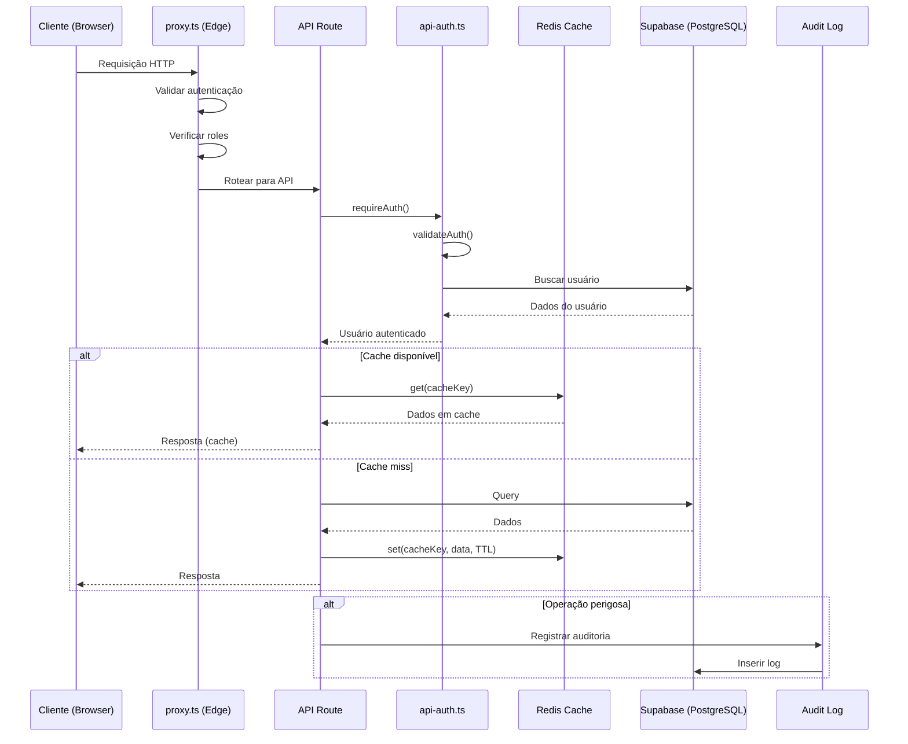
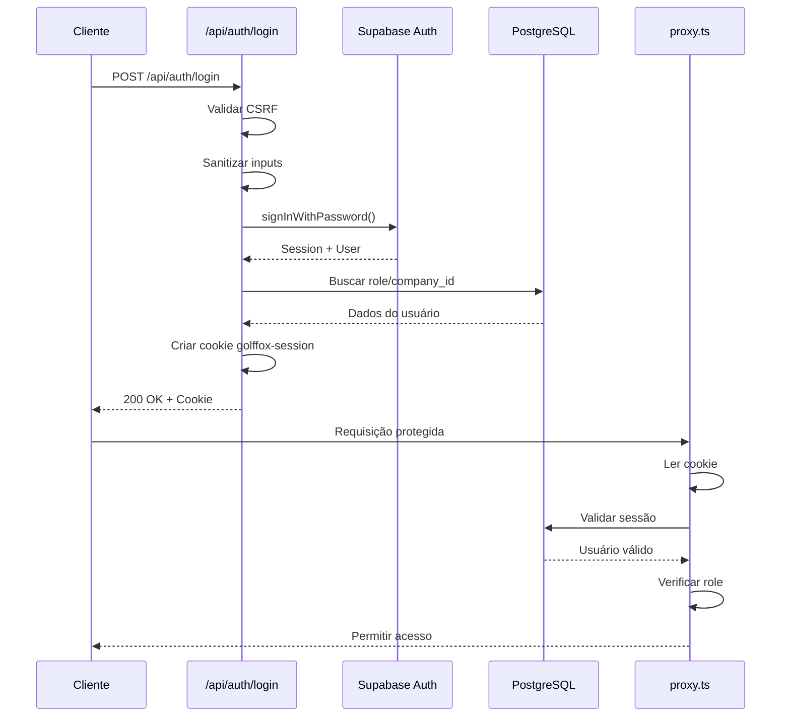
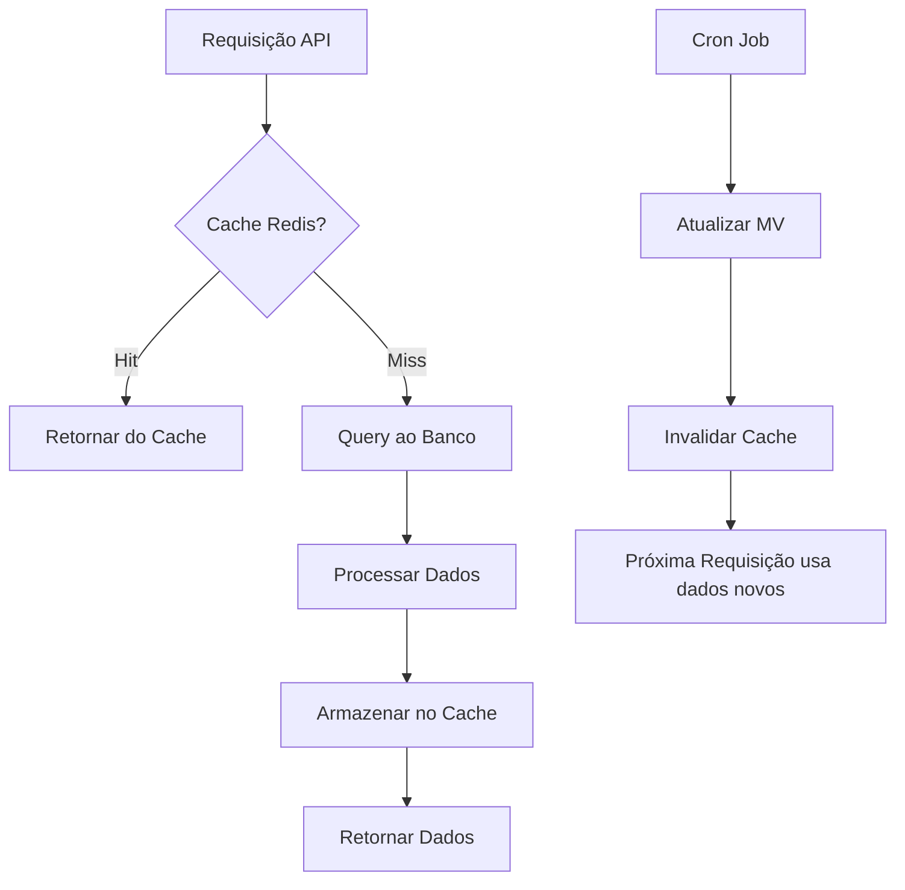
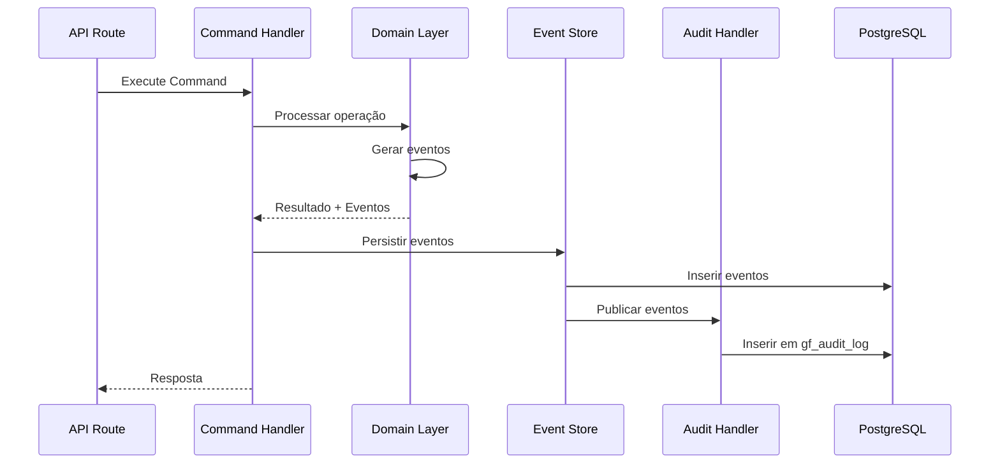
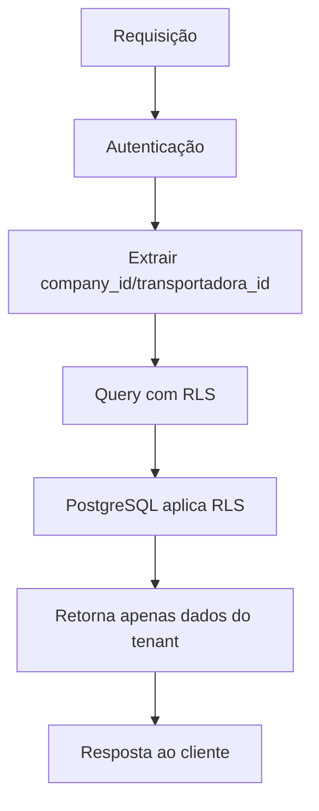
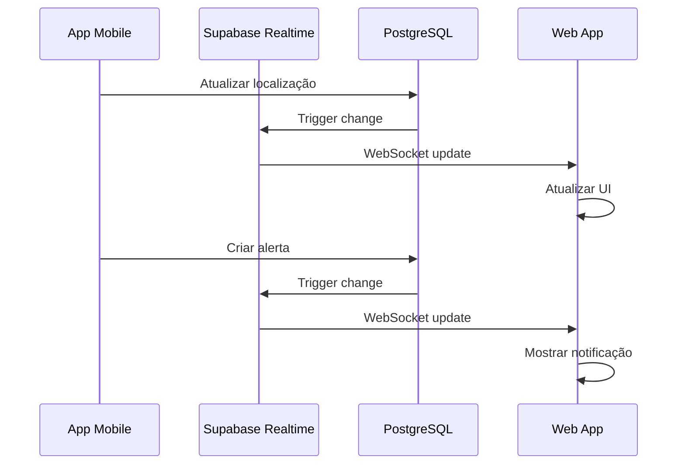
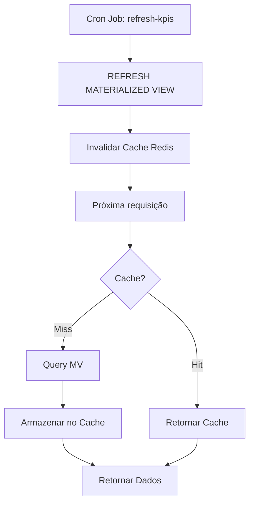
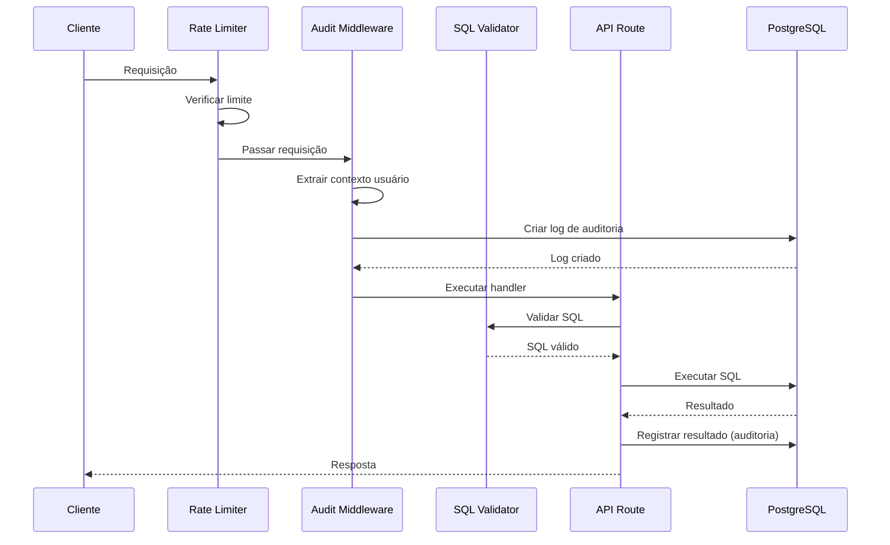

# Diagrama de Fluxo de Dados - GolfFox

**Última atualização:** 2025-01-XX

---

## 📊 Visão Geral

Este documento descreve o fluxo de dados no sistema GolfFox, desde a requisição do cliente até a resposta.

---

## 🔄 Fluxo de Requisição API

---

## 🔐 Fluxo de Autenticação

---

## 💾 Fluxo de Cache

---

## 📝 Fluxo de Auditoria (CQRS/Event Sourcing)

---

## 🗄️ Fluxo de Dados Multi-Tenant

---

## 🔄 Fluxo de Sincronização Realtime

---

## 📊 Fluxo de KPIs

---

## 🔒 Fluxo de Rotas Perigosas

---

**Última atualização:** 2025-01-XX
